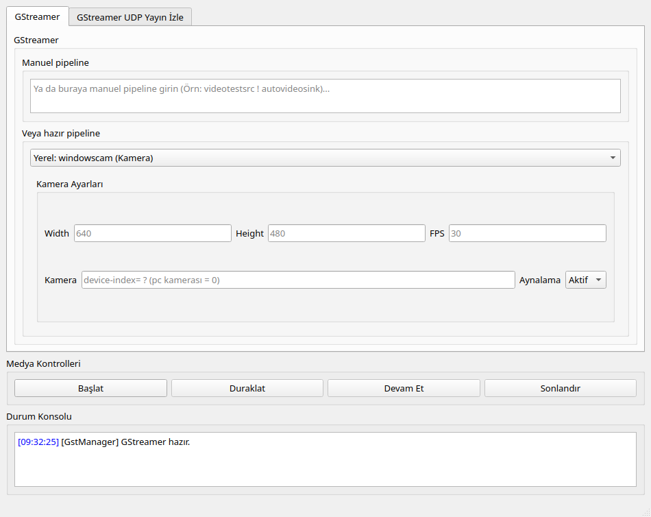
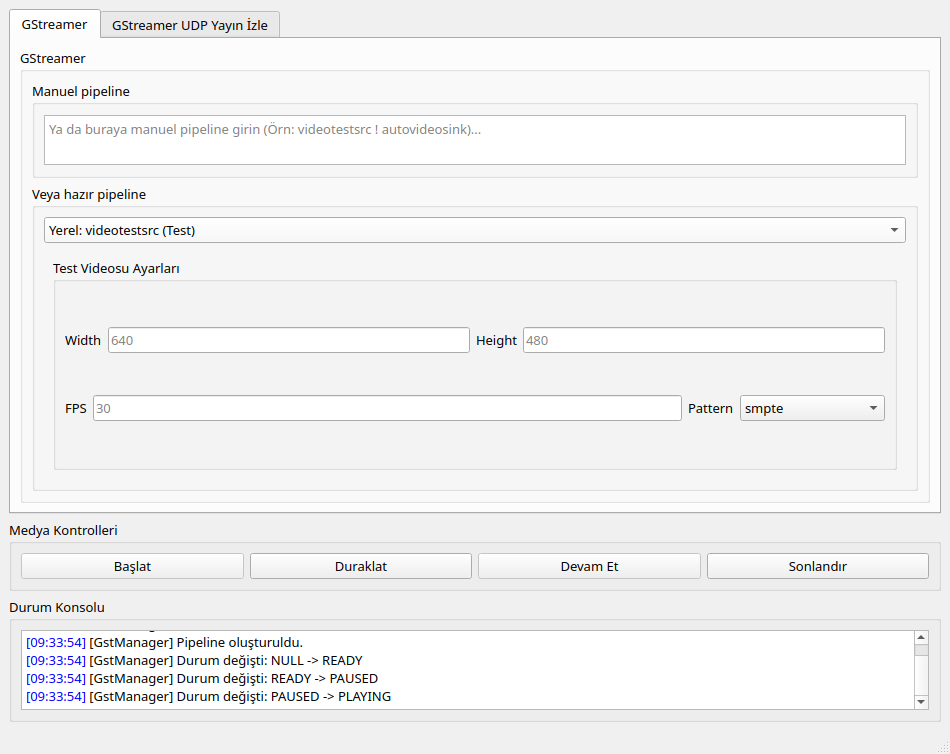
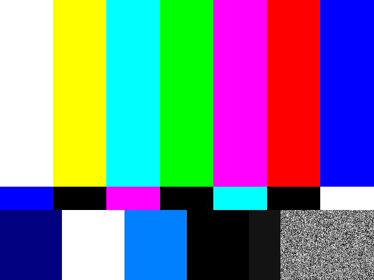
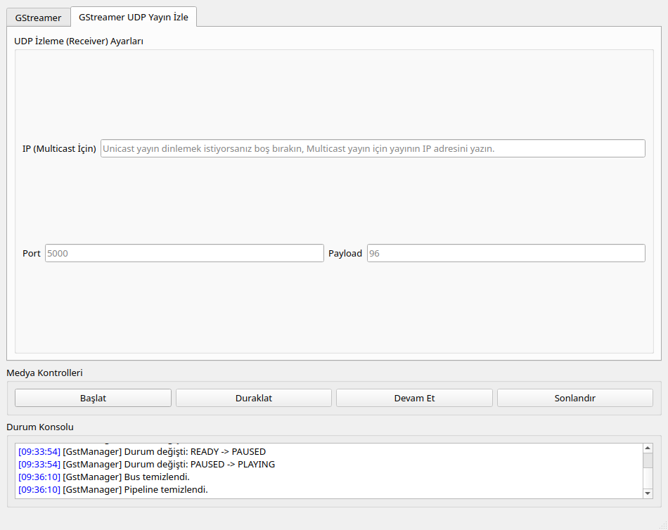

# GStreamer Manager (Qt GUI)

**GStreamerGUI**, [gstreamer-cpp-library](https://github.com/r1b1t/gstreamer-cpp-library) üzerine inşa edilmiş bir **Qt6 kontrol paneli**dir. GStreamer pipeline'larını komut satırı veya kod yazmadan; kamera/ekran/dosya yayınlama, test görüntüsü üretme, UDP unicast/multicast gönderme ve UDP yayın izleme gibi işleri form doldurup butona basarak yapmayı sağlar.

Amaç, alttaki kütüphanenin pipeline üreticilerini (`GstPipelineBuilder`) görsel bir arayüzle test edilebilir hale getirmek: elle `gst-launch` string'i yazmadan hazır senaryoları deneyebilmek, kendi pipeline'ını yazıp anlık çalıştırabilmek ve kütüphanenin `stdout`/`stderr` çıktısını (durum geçişleri, hatalar, EOS) renkli bir konsolda canlı izleyebilmek.

Hem **Linux** hem **Windows (MSYS2/MinGW64)** üzerinde derlenip çalışır.

## Ekran Görüntüleri

Açılış hâli:



`videotestsrc` preset'i ile bir pipeline çalıştırıldığında — kontrol paneli PLAYING durumuna geçiyor, buton durumları güncelleniyor ve konsolda GStreamer'ın durum geçişleri görünüyor:



Aynı pipeline'ın video çıktısı (`autovideosink` ile ayrı bir pencerede render edilir):



UDP yayın izleme (receiver) sekmesi — pipeline durdurulduğunda kaynakların düzgün temizlendiği konsolda görülebiliyor:



> Ekran görüntüleri Linux üzerinde, izole bir X görüntüsünde alınmıştır. Arayüz Windows'ta birebir aynı şekilde çalışır.

## Özellikler

- 🎛️ **Manuel pipeline** — kendi `gst-launch` sözdizimindeki pipeline'ınızı yazıp doğrudan çalıştırın
- 📋 **Hazır presetler** — kamera, test görüntüsü (SMPTE, snow, ball, checkers... 20+ desen), video dosyası, ekran paylaşımı; her biri kendi ayar formuyla (çözünürlük, FPS, kaynak özel parametreler)
- 📡 **UDP Unicast / Multicast gönderici** — yukarıdaki kaynaklardan birini seçip IP/port/bitrate/payload ayarlarıyla ağa yayınlayın
- 👁️ **UDP yayın izleme** — unicast dinleme veya multicast gruba katılma, port ve payload type ile alıcı pipeline'ı kurar
- ▶️ **Medya kontrolleri** — Başlat / Duraklat / Devam Et / Sonlandır; buton etkinlikleri her zaman gerçek pipeline durumuna göre güncellenir
- 🖥️ **Canlı konsol** — kütüphanenin `std::cout`/`std::cerr` çıktısı zaman damgalı ve renkli olarak arayüze yakalanır (`LogRedirector`); kritik hata veya EOS algılanırsa pipeline otomatik olarak durdurulur
- 📁 **Dosya seçici** — video oynatma / UDP kaynağı için dosya yolu, "Dosya Seç" diyaloğuyla girilebilir
- ⚙️ **CMake FetchContent** — `gstreamer-cpp-library`'yi derleme sırasında otomatik indirir, ayrıca bağlamanız gerekmez

## Mimari

Arayüz mantığı sorumluluklara göre ayrılmıştır:

| Sınıf | Görev |
|---|---|
| `MainWindow` | Ana pencere; log yakalama, dosya seçimi, "Başlat" tıklamasında hangi sekme/preset'in çalıştırılacağına karar verme |
| `PlayerController` | Play/Pause/Resume/Stop butonlarının `GstManager` ile senkronizasyonu ve buton etkinlik durumları |
| `PresetPipelineExecutor` | Hazır preset'lerin (kamera, test, dosya, ekran, UDP gönderici) UI alanlarından okunup pipeline string'ine dönüştürülmesi |
| `ManualPipelineExecutor` | Manuel pipeline metin kutusundaki string'in doğrudan çalıştırılması |
| `UdpWatcherExecutor` | UDP izleme sekmesindeki alıcı pipeline'ının kurulması |
| `LogRedirector` | `std::ostream` tabanlı `streambuf` ile `cout`/`cerr`'i satır satır yakalayıp Qt sinyaline çevirir |

Pipeline yürütme ve GStreamer yaşam döngüsü tamamen [gstreamer-cpp-library](https://github.com/r1b1t/gstreamer-cpp-library)'nin `GstManager` ve `GstPipelineBuilder` sınıflarına devredilmiştir — bu uygulama üzerine ince bir Qt katmanı ekler.

## Bağımlılıklar

- Qt 6.4+ (Core, Widgets)
- GStreamer 1.0 (`gstreamer-1.0`, `gstreamer-app-1.0`, `gstreamer-rtsp-server-1.0`)
- Poppler (`poppler-cpp`) — `gstreamer-cpp-library` üzerinden gelir
- CMake ≥ 3.19, C++17 derleyici, pkg-config

## Kurulum — Linux

```bash
sudo apt install cmake g++ pkg-config qt6-base-dev \
    libgstreamer1.0-dev libgstreamer-plugins-base1.0-dev \
    libgstrtspserver-1.0-dev libpoppler-cpp-dev \
    gstreamer1.0-plugins-good gstreamer1.0-plugins-bad gstreamer1.0-plugins-ugly
```

Derleyip çalıştırın:

```bash
git clone https://github.com/r1b1t/gstreamer-manager-qt-app.git
cd gstreamer-manager-qt-app
cmake -B build -DCMAKE_BUILD_TYPE=Release
cmake --build build -j$(nproc)
./build/GStreamerGUI
```

CMake, `gstreamer-cpp-library`'yi `FetchContent` ile otomatik indirip birlikte derler; ayrıca kurmanıza gerek yoktur.

## Kurulum — Windows (MSYS2 / MinGW64)

Adımlar **MSYS2 MinGW64 terminalinde** çalıştırılmalıdır.

```bash
pacman -S mingw-w64-x86_64-cmake mingw-w64-x86_64-gcc mingw-w64-x86_64-pkgconf \
          mingw-w64-x86_64-qt6-base \
          mingw-w64-x86_64-gstreamer \
          mingw-w64-x86_64-gst-plugins-base \
          mingw-w64-x86_64-gst-plugins-good \
          mingw-w64-x86_64-gst-plugins-ugly \
          mingw-w64-x86_64-gst-rtsp-server \
          mingw-w64-x86_64-poppler

git clone https://github.com/r1b1t/gstreamer-manager-qt-app.git
cd gstreamer-manager-qt-app
mkdir build && cd build

/mingw64/bin/cmake -G "MinGW Makefiles" \
  -DPKG_CONFIG_EXECUTABLE=/mingw64/bin/pkg-config \
  ..

cmake --build .
./GStreamerGUI.exe
```

Windows'ta `cmake --install .` çalıştırılırsa `qt_generate_deploy_app_script` devreye girer ve gerekli Qt DLL'leri çalıştırılabilir dosyanın yanına kopyalanır (bağımsız dağıtım için).

## Kullanım

1. **GStreamer** sekmesinde bir kaynak seçin: manuel pipeline yazın veya açılır listeden hazır bir senaryo seçin (kamera, test görüntüsü, dosya, ekran, UDP gönderici)
2. İlgili ayar formunu doldurun (çözünürlük, FPS, IP/port, dosya yolu vb.)
3. **Başlat**'a basın — pipeline kurulur ve oynamaya başlar; video çıkışı ekrana/ağa yönlendirilir
4. **Duraklat / Devam Et / Sonlandır** ile pipeline'ı yönetin
5. Alt konsoldan GStreamer durum geçişlerini ve olası hataları takip edin
6. Karşı taraftaki yayını izlemek için **GStreamer UDP Yayın İzle** sekmesine geçip IP (multicast için)/port/payload girip **Başlat**'a basın

## İlgili Projeler

- [gstreamer-cpp-library](https://github.com/r1b1t/gstreamer-cpp-library) — bu uygulamanın kullandığı C++ pipeline yönetim kütüphanesi
- [gstreamer-sharp-player](https://github.com/r1b1t/gstreamer-sharp-player) — aynı fikrin C#/WinForms + GstSharp ile basit bir örneği

## Kullanılan Teknolojiler

| Teknoloji | Amaç |
|---|---|
| Qt 6 (Widgets) | Masaüstü arayüzü |
| [gstreamer-cpp-library](https://github.com/r1b1t/gstreamer-cpp-library) | Pipeline oluşturma ve yaşam döngüsü yönetimi |
| GStreamer 1.0 | Medya pipeline altyapısı |
| CMake (FetchContent) | Derleme ve bağımlılık yönetimi |
| C++17 | Uygulama mantığı |
